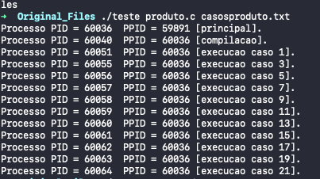

<h1 align="center">
    
</h1>

Trabalho em C

Sistemas Operativos    
    
Programa em linguagem C padrão, de nome teste.c, que permita efetuar o teste de um programa.
O programa recebe dois argumentos, com o programa a testar e os casos de teste:

📌 Programa sobre PID e PPID
------------------

## Sintaxe de uso:

<pre>teste {programa.c} {casos.txt} </pre>

O projeto foi feito em C.

The project was done with C.

🔧 Tecnologias utilizadas:
------------------

- C 

💬 Fale comigo
------------------
[*Entre em contato comigo*](https://www.linkedin.com/in/ivo-baptista-3712144/)

